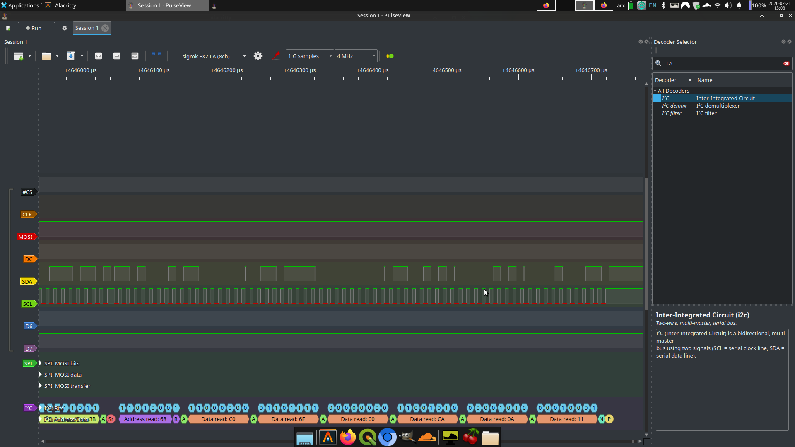
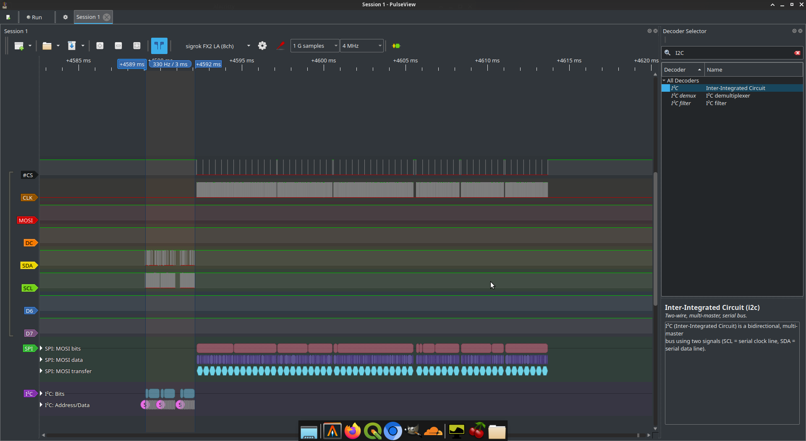
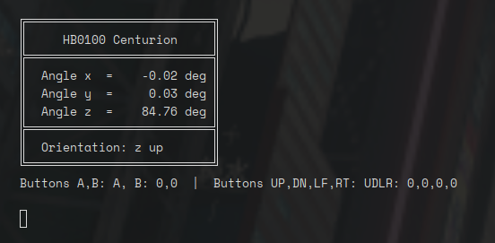

# HackerBox 0100 — Centurion Bus Analysis Target

> Homelab teardown and hands-on exploration of the Centurion PCB — covering SPI display debugging, I2C sensor sniffing with a logic analyzer, and firmware improvements.

---

## Hardware

- **Board:** HackerBox 0100 Centurion
- **MCU:** Raspberry Pi Pico (RP2040)
- **Display:** GC9A01 240x240 round TFT (SPI)
- **IMU:** MPU9250 9-axis accelerometer/gyro/magnetometer (I2C)
- **Logic Analyzer:** NanoDLA (PulseView)

---

## Getting the Demo Running

### Board Core
The demo sketch requires the **Earle Philhower RP2040 core** — not the official Arduino Mbed OS core. The Mbed core does not support `Wire.setSDA()` / `Wire.setSCL()`.

Add this URL to Arduino IDE under **File → Preferences → Additional Board Manager URLs:**
```
https://github.com/earlephilhower/arduino-pico/releases/download/global/package_rp2040_index.json
```
Then install **"Raspberry Pi Pico/RP2040 by Earle F. Philhower III"** from Boards Manager.

### Required Libraries
- `GFX Library for Arduino` by Moon On Our Nation
- `MPU9250_WE` by Wolfgang Ewald

### Color Constants Fix
The demo sketch references color constants not defined by the GFX library. Add these defines after your includes:
```cpp
#define BLACK   0x0000
#define RED     0xF800
#define YELLOW  0xFFE0
#define WHITE   0xFFFF
```

---

## SPI Bus Analysis — GC9A01 Display

### Logic Analyzer Hookup

| Signal | Pico GPIO |
|--------|-----------|
| CS     | GP9       |
| CLK    | GP10      |
| MOSI   | GP11      |
| DC     | GP8       |
| GND    | Any GND   |

MISO is not used — the display is write-only.

### PulseView Settings
- **Decoder:** SPI
- **Mode:** Mode 0 (CPOL=0, CPHA=0)
- **Bit order:** MSB first
- **Sample rate:** 4MHz minimum (the display clock runs at hundreds of kHz — always sample at least 4–10x the bus frequency)
- **DC pin:** Add as extra channel and assign to SPI decoder's D/C input to distinguish commands from pixel data

### What You See on MOSI
Traffic comes in bursts — each burst is a window-set command followed by a flood of RGB565 pixel data. With DC hooked up, PulseView labels each byte as command or data automatically.


---

## I2C Bus Analysis — MPU9250 IMU

### Logic Analyzer Hookup

| Signal | Pico GPIO |
|--------|-----------|
| SDA    | GP0       |
| SCL    | GP1       |
| GND    | Any GND   |

### PulseView Settings
- **Decoder:** I2C
- **Sample rate:** 4MHz+ (I2C runs at 100kHz or 400kHz — 20kHz sample rate will miss edges)

### Reading the Data
The Pico polls the MPU9250 at address **0x68**. A typical accelerometer read looks like:

| Annotation | Meaning |
|------------|---------|
| AW 0x68    | Address the sensor for writing |
| DW 0x3B    | Point to ACCEL_XOUT_H register |
| AR 0x68    | Switch to read mode |
| DR × 6     | 6 bytes: X_H, X_L, Y_H, Y_L, Z_H, Z_L |

Combine each high/low byte pair as a signed 16-bit integer:
```cpp
int16_t x = (DR1 << 8) | DR2;
float x_g = x / 16384.0; // at ±2g range
```

When the board is flat, gravity (~1g) appears on whichever axis points down. The other two axes read near zero.

---

## Firmware Improvements

### 1. Modified `delay(300)` in loop
Biggest single improvement — the display now updates every 30ms (tested) on bus, confirmed that the I2C conversation is only 3ms, with the rest as headroom for the bus to settle and switch to the SPI.



### 2. TUI Serial Output
Replaced scrolling serial output with an in-place terminal UI using ANSI escape codes. Open with `screen` or PuTTY at 115200 baud — the Arduino Serial Monitor does not support ANSI codes.

```cpp
void SerPrintMPU(){
  xyzFloat angle = myMPU9250.getAngles();
  
  Serial.print("\033[H"); // home cursor, no flicker clear
  Serial.print("╔══════════════════════════╗\r\n");
  Serial.print("║     HB0100 Centurion     ║\r\n");
  Serial.print("╠══════════════════════════╣\r\n");
  Serial.printf("║  Angle x  = %8.2f deg  ║\r\n", angle.x);
  Serial.printf("║  Angle y  = %8.2f deg  ║\r\n", angle.y);
  Serial.printf("║  Angle z  = %8.2f deg  ║\r\n", angle.z);
  Serial.print("╠══════════════════════════╣\r\n");
  Serial.printf("║  Orientation: %-11s║\r\n", myMPU9250.getOrientationAsString().c_str());
  Serial.print("╚══════════════════════════╝\r\n");
}
```



**Key detail:** `\033[H` homes the cursor without clearing the screen — overwriting in place eliminates the jitter that `\033[2J\033[H` causes.

**Connect via screen (Linux/Mac):**
```bash
screen /dev/ttyACM0 115200
```

### 4. Next Step — Hardware SPI
The sketch currently uses software SPI (`Arduino_SWSPI`) which bit-bangs every pixel. Switching to hardware SPI will dramatically increase display refresh rate:
```cpp
// Replace this:
Arduino_DataBus *bus = new Arduino_SWSPI(TFTDC, TFTCS, TFTCLK, TFTDIN, -1);

// With this:
Arduino_DataBus *bus = new Arduino_RPiPicoSPI(TFTDC, TFTCS, TFTCLK, TFTDIN, -1);
```

---

## Key Takeaways

- Always sample at **4–10x the bus clock frequency** in PulseView — too low and you'll decode garbage
- The MPU9250 axes are defined relative to the chip's physical orientation — axis-to-world mapping is done in firmware
- ANSI escape codes + `screen` turn a basic serial connection into a surprisingly usable live dashboard
- Software SPI is a significant bottleneck for display-heavy applications — hardware SPI is a near-zero-effort swap with a huge payoff
