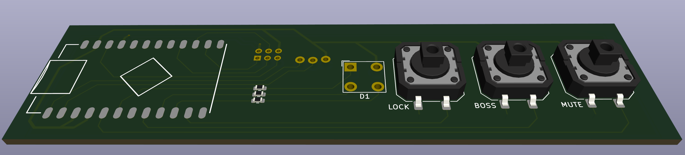
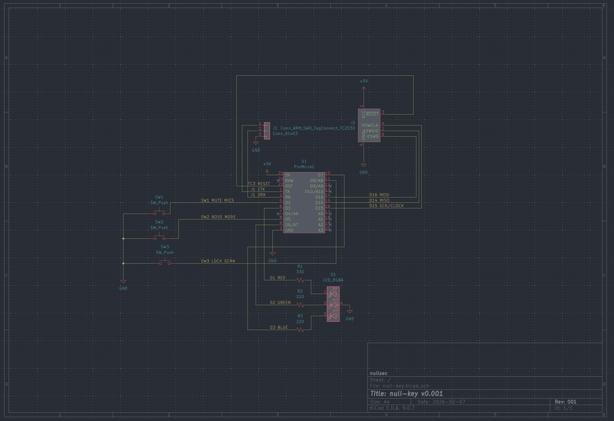
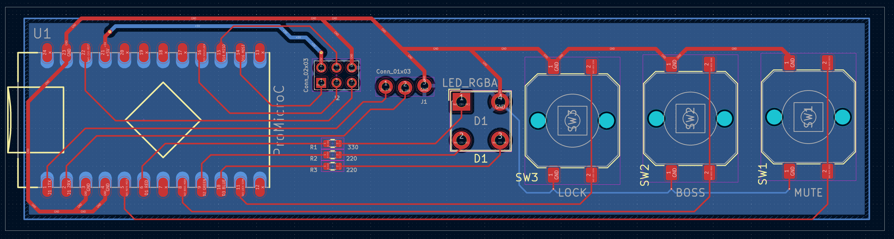
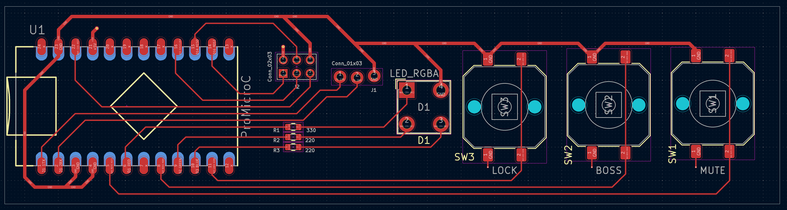
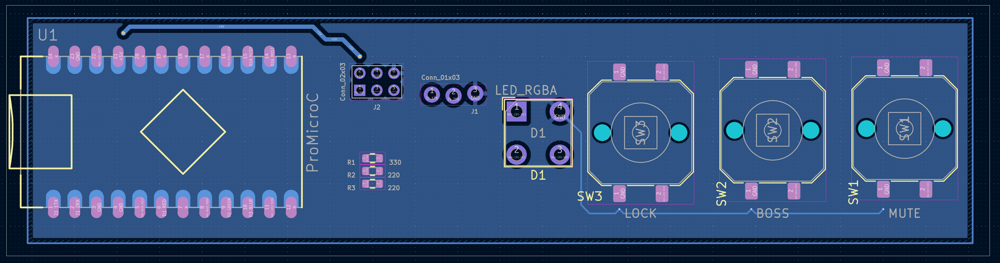

# null-key

A minimal 3-button USB HID macro device built around the Waveshare Pro Micro C (ATmega32U4). Designed as an open hardware experiment in compact input device design with a focus on clean schematic practice and real-world PCB layout.

---



## What it does

Three tactile buttons mapped as HID macro keys over USB. An RGB status LED provides visual feedback. Intended use cases include PTT mute, screen lock, and custom workflow triggers — but it's just HID, so it's whatever you want it to be.

---

## Hardware

- **MCU:** Waveshare Pro Micro C (ATmega32U4)
- **Interface:** USB HID via onboard USB-C
- **Inputs:** 3x tactile pushbutton (active low, internal pull-ups)
- **Output:** Common cathode RGB LED with current limiting resistors (330Ω R, 220Ω G/B)
- **Protection:** USBLC6-2SC6 TVS diode on USB data lines
- **Programming:** 2x3 ICSP header (AVR ISP)
- **ESD:** USBLC6-2SC6 (next version)

## Design decisions

- Active low buttons chosen to leverage ATmega32U4 internal pull-ups, no external resistors needed
- ICSP header over TagConnect — simpler routing on 2-layer board, more practical for proto
- Ground pour on B.Cu for noise reduction and simplified ground routing
- 2-layer PCB, designed for JLCPCB standard stackup





---
All layers:

Front copper:

Back copper:



## Repository structure

```
nullkey/
├── hardware/
│   ├── nullkey.kicad_pro
│   ├── nullkey.kicad_sch
│   ├── nullkey.kicad_pcb
│   └── gerbers/
├── firmware/          
└── README.md
```

---

## Status

- [x] Schematic complete
- [x] PCB routed, DRC clean
- [ ] Boards ordered
- [x] Firmware 
- [ ] Testing

---

## License

Hardware (schematic, PCB): CERN-OHL-P v2
Firmware: Apache 2.0

---


